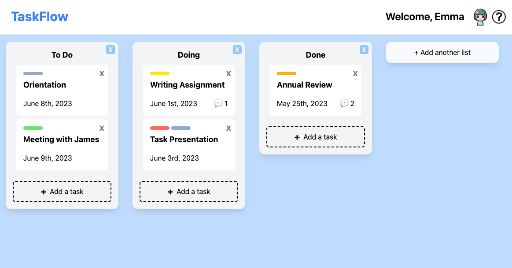

# TaskFlow

TaskFlow is a Trello-like project management app built with React.js, TypeScript, and Tailwind CSS. It features a drag-and-drop interface for intuitive task and list management. 

Live Demo: [TaskFlow](https://task-flow2.netlify.app)

Design: [UI Design Document](https://docs.google.com/document/d/1Jcm2m_0JU7I3wTxKmUdtUlqaFRzLCXj7Lu2MYoC4ZXg/edit?usp=sharing)

## Features

- Create, update, and delete tasks and lists
- Drag-and-drop tasks across different lists
- State management via local storage to persist tasks and lists across sessions
- Use of the Facade pattern for efficient and encapsulated interaction with the local storage

## Tech Stack

- React.js
- TypeScript
- Tailwind CSS
- Local Storage for state management

## Libraries
- React Beautiful DnD
- UUID
- Jest
- Vite

## How to Use

1. Visit the [live demo](https://task-flow2.netlify.app).
2. Select your avatar and enter your username to enter the app.
3. Create a new list by clicking on the "Add a new list" button and filling out the form.
4. Create a new task within a list by clicking on the "Add a new task" button and filling out the form.
5. Drag-and-drop tasks across different lists as needed.
6. Update tasks by clicking on the task, making changes in the popup form, and clicking on the save button.
7. Delete tasks or lists by clicking on the delete button.

All your tasks and lists are automatically saved in your browser's local storage for persistence across sessions.
